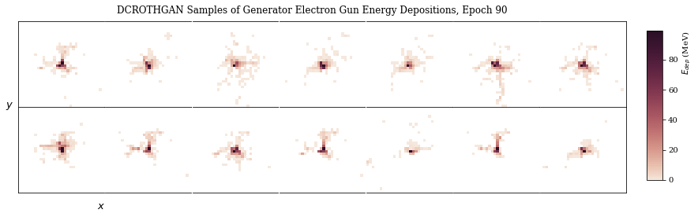
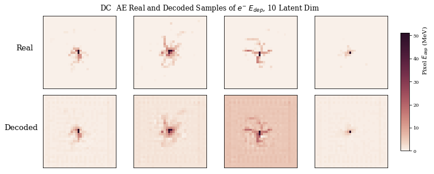
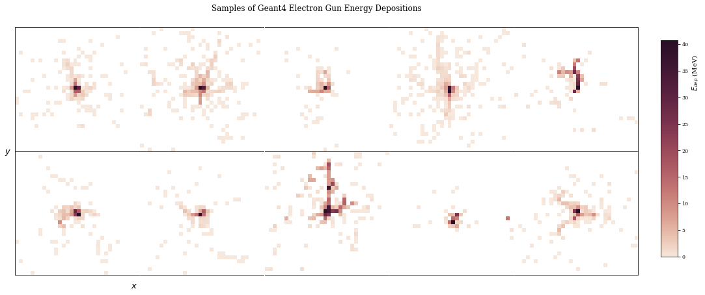
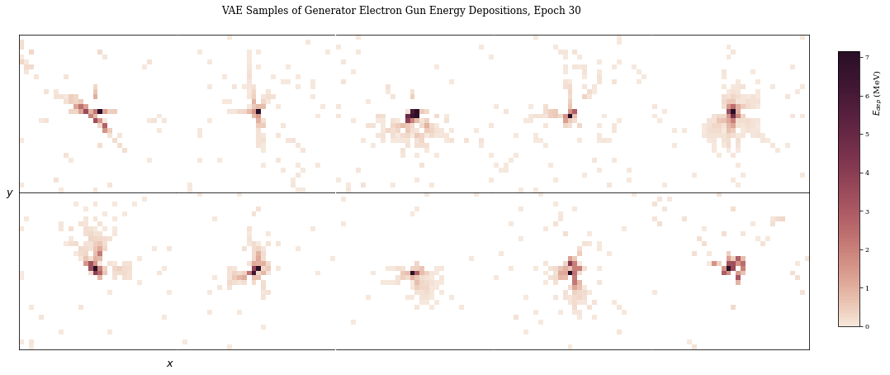

If one wants to load the data using the geant_dataloader.py file, you need ROOT and root_numpy. If not, just replace the calls to rtnpy_load_data with:

image_array = np.load(numpy_data/filename)['array']

because I saved the data files in compressed numpy arrays in numpy_data/

Otherwise, to run, one needs PyTorch 0.4. There are other packages that you should see at the top of the script if you need to install, like seaborn and such.

The code will try to save image files during training, and it will declare the directory to save them to right before training begins. just set mydir = None to prevent this and comment out the lines that try to make the directory based off the date and time.

Here is example GAN output:

Here is convolutional autoencoding

Here are real samples followed by samples from a fully connected VAE.

